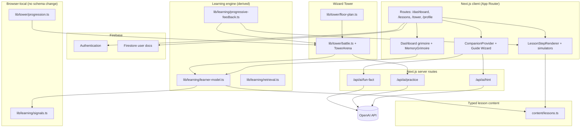

# Brilliant Quantum

**Subject: Quantum Computing Fundamentals**

Brilliant Quantum is a learn-by-doing web app that teaches introductory quantum computing through short, interactive lessons instead of videos or long readings. Across six units, learners build intuition for qubits, superposition, measurement, gates, circuits, interference, entanglement, algorithms, and hardware by manipulating live visualizations, predicting outcomes, and getting immediate feedback. A learning-science engine and an AI “wizard” companion adapt practice and hints to each learner — no advanced mathematics required.

- **Live app:** _<add your deployed URL here, e.g. https://brilliant-quantum.vercel.app>_
- **Demo account:** _<email>_ / _<password>_ _(replace with a real demo login, or sign up)_

## Tech stack

| Layer | Technology |
| --- | --- |
| App framework | [Next.js 16](https://nextjs.org) (App Router, React 19) |
| Language | TypeScript |
| Styling | Tailwind CSS 4 |
| Auth | Firebase Authentication (email/password + Google) |
| Database | Cloud Firestore (user progress, profile, streaks) |
| AI | OpenAI API (server-side hints, practice, fun facts) |
| Math | KaTeX via `react-katex` |
| Hosting | Vercel (recommended) |
| Tests | Vitest (pure lesson / learning / tower logic) |

## Features

- **Interactive quantum lessons** — six units of bite-sized lessons taught through reusable, configurable visualizations and simulators (Bloch sphere, gate labs, circuit builders, amplitude/interference explorers, two-qubit and entanglement tools, search/oracle/period-finding, hardware comparisons, and more), built with React and inline SVG.
- **Progress persistence** — current step, completion, attempts, and streaks are saved per user in Cloud Firestore, so learners can leave and resume exactly where they left off.
- **AI wizard companion** — a floating Guide Wizard offers **hints**, **practice questions**, and **fun facts** through server-side OpenAI calls. All AI is additive and degrades gracefully: if the key is missing or a request fails, handwritten fallbacks keep every lesson fully usable with AI turned off.
- **Wizard Tower** (`/tower`) — a retrieval-practice arena with seven floors (six unit reviews + Eve boss). Learners battle concept “monsters” with quick recall questions, progressive feedback, and a floor map.
- **Learning science engine** — a lightweight, client-side learner model tracks per-concept signals and drives **retrieval practice**, **spaced review**, **progressive (leveled) hints**, **worked examples**, prerequisite reminders, and **mastery** language. See [`LEARNING_SCIENCE.md`](./LEARNING_SCIENCE.md).
- **Achievements & avatar** — badge unlock ceremonies, profile stats, and a customizable pixel-wizard avatar.
- **Mobile-first layouts** — responsive Tailwind, 44px touch targets on primary controls, horizontal overflow clipped, safe-area padding on floating controls; animations honor `prefers-reduced-motion`.

## Architecture



**Data flow in brief:** lesson content lives in typed TS data; Firestore stores durable progress; localStorage holds learning signals and Tower cursor; the learner model is derived from both. AI routes never expose keys to the browser.

## Project structure

```text
brilliant-quantum/
├── app/                      # App Router routes, layouts, global styles
│   ├── api/ai/               # Server-only AI: hint, practice, fun-fact
│   ├── dashboard/            # Course path, grimoire, tower entry
│   ├── lessons/[lessonId]/   # Lesson player
│   ├── tower/                # Wizard Tower arena
│   ├── profile/              # Profile + avatar
│   ├── login/ signup/        # Auth pages
│   └── layout.tsx            # Root layout, providers, companion mount
├── components/               # UI, simulators, companions, dashboard, tower
│   ├── companions/           # Floating wizard system (provider, drag, speech)
│   ├── dashboard/            # Progress panel, tower card, unit sigils
│   ├── tower/                # TowerArena, challenges, floor map, transitions
│   └── LessonStepRenderer.tsx
├── content/lessons.ts        # All units, lessons, steps, prompts, feedback
├── hooks/                    # Shared React hooks (e.g. useReducedMotion)
├── lib/
│   ├── firebase.ts           # Firebase app, Auth, Firestore init
│   ├── auth-context.tsx      # Auth provider + useAuth()
│   ├── progress.ts           # Firestore profile/progress reads & writes
│   ├── ai/                   # Server-only AI client, prompts, validators
│   ├── learning/             # Concepts, signals, learner model, retrieval
│   ├── companions/           # Companion types, anchors, messages, physics
│   ├── tower/                # Floor plan, progression, battle, challenges
│   ├── achievements/         # Achievement catalog + evaluation
│   ├── profile/              # Avatar config + activity/streak helpers
│   └── utils/                # Small shared helpers (clamp, etc.)
├── scripts/verify-tower-bank.ts
└── firestore.rules           # Firestore security rules
```

**Module boundaries:** `content/lessons.ts` is the single source of pedagogical structure; `lib/learning/*` derives scheduling and feedback without changing Firestore schema; `lib/tower/*` owns Tower pure logic and local persistence; `components/*` renders and wires user interaction; `app/api/ai/*` is the only place OpenAI keys are read.

## Setup

```bash
npm install
```

Create a `.env.local` file in the project root:

**Firebase** (client config — public by design, from Firebase Console → Project settings → Your apps):

```text
NEXT_PUBLIC_FIREBASE_API_KEY=
NEXT_PUBLIC_FIREBASE_AUTH_DOMAIN=
NEXT_PUBLIC_FIREBASE_PROJECT_ID=
NEXT_PUBLIC_FIREBASE_STORAGE_BUCKET=
NEXT_PUBLIC_FIREBASE_MESSAGING_SENDER_ID=
NEXT_PUBLIC_FIREBASE_APP_ID=
```

**OpenAI** (server-only — required for AI features):

```text
OPENAI_API_KEY=
# Optional overrides:
# OPENAI_BASE_URL=https://api.openai.com/v1
# OPENAI_MODEL=gpt-4o-mini
```

In the Firebase Console: enable **Authentication → Email/Password** (and **Google** if desired), create a **Cloud Firestore** database, and deploy the rules in `firestore.rules` (each user can read/write only their own document).

## Scripts

| Command | Description |
| --- | --- |
| `npm run dev` | Dev server at http://localhost:3000 |
| `npm run build` | Production build |
| `npm run start` | Serve production build |
| `npm run lint` | ESLint |
| `npm run test` | Vitest unit tests (lesson / learning / tower logic) |
| `npm run test:watch` | Vitest in watch mode |
| `npm run verify:tower` | Validate Tower question bank |

The app works without `OPENAI_API_KEY` — AI features fall back to handwritten content.

## Testing locally

1. Copy env vars into `.env.local` (Firebase required for auth/progress; OpenAI optional).
2. `npm run dev` — sign up or log in, walk a lesson, open `/tower`, summon the wizard from the dashboard.
3. `npm run test` — pure logic tests (no browser).
4. `npm run lint && npm run build` — CI-style check before opening a PR.

Resize the browser to ~375px width (or use device mode) to verify NavBar, lesson footer, dashboard grimoire stats, and Tower map buttons.

## Wizard Tower overview

| Floor | Theme | Unlock |
| --- | --- | --- |
| 1–6 | Unit review (3 chambers each) | Complete matching course unit |
| 7 | Mixed retrieval vs Eve (boss) | Clear floors 1–6 **or** finish all units |

Tower progress (`floor`, cleared chambers, boss seed) persists in `localStorage` under `bq-tower-progress-v2`. Concept selection interleaves current-unit, prior-unit, and weak/due review tags using the learner model.

## Lessons overview

Six units, ~30 interactive lessons total, each built from typed `LessonStep` data rendered by `LessonStepRenderer`. Steps include predictions, simulators, circuit builders, worked examples, and graded challenges. Unlock order is linear within the course; completed lessons stay reachable.

## Deployment

Deployed on **Vercel**:

1. Push the repo to GitHub and import it into Vercel (Next.js is detected automatically).
2. Add all environment variables for Production, Preview, and Development:
   - the six `NEXT_PUBLIC_FIREBASE_*` values
   - `OPENAI_API_KEY` (plus optional `OPENAI_BASE_URL` / `OPENAI_MODEL`)
   - Because `NEXT_PUBLIC_*` vars are inlined at build time, they must exist **before** the build runs.
3. Deploy from GitHub.
4. Add the Vercel domain to **Firebase Authentication → Settings → Authorized domains**.

## Security

- **Never commit `.env.local`** (or any real keys). It is covered by `.gitignore` (`.env*`).
- **`OPENAI_API_KEY` must stay server-side — do NOT prefix it with `NEXT_PUBLIC_`.** It is read only inside `app/api/ai/*` via `lib/ai/client.ts`.
- **`NEXT_PUBLIC_FIREBASE_*` values are safe to expose** (client config protected by Firestore security rules).

## Further reading

- [`LEARNING_SCIENCE.md`](./LEARNING_SCIENCE.md) — retrieval, spacing, progressive feedback
- [`PRD.md`](./PRD.md) — product requirements (internal)
- [`AGENTS.md`](./AGENTS.md) — agent notes for this Next.js version
